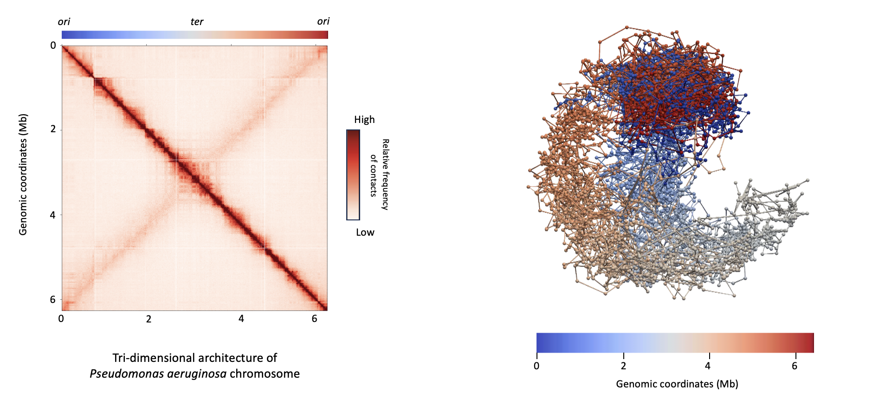

# TP AdG 2026

* Analyse de la conformation spatiale des chromosomes bactériens.
* étude de l'infection d'un phage et de la dynamique de son chromosome.




Ce TP a pour objectif de vous apprendre à analyser des données de Hi-C.
[publication](https://www.science.org/doi/10.1126/science.1181369)

Nous allons partir des fichiers FastQ issus du séquençage de nos librairies et réaliser l'ensemble de l'analyse.
L'objectif est d'apprendre à réaliser ces analyses, comprendre ce qu'elles peuvent apporter sur la compréhension de l'architecture du chromosome bactérien afin d'appliquer ce que vous aurez appris sur un jeux de données issues d'une cinétique de l'infection de Pseudomonas aeruginosa par le phage PAK_P3.


Le TP s'organisera de la manière suivante:

- Chaque session aura son propre fichier "tuto" associé.

NB1: chaque ligne de commande est indiquée et peut être directement copié du github vers le terminal (cf ci-dessous)

```sh
echo "ceci est une ligne de commande"
```

## Planning des sessions 

* 1 - mise en place de l'environnement et récupération des données.
* 2 - génération du fichier matrice (fichier .cool) et visualisation d'une matrice.
* 3 - comparaison de matrices.
* 4 - analyse de matrice.
* 5 - analyse de données de RNAseq.
* 6 - intégration des données HiC et de RNAseq.
* 7 - session en autonomie.


## Contact

### Authors

* martial.marbouty@pasteur.fr

### Research lab

[Spatial Regulation of Genomes](https://research.pasteur.fr/en/team/spatial-regulation-of-genomes/) (Institut Pasteur, Paris)

