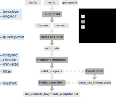
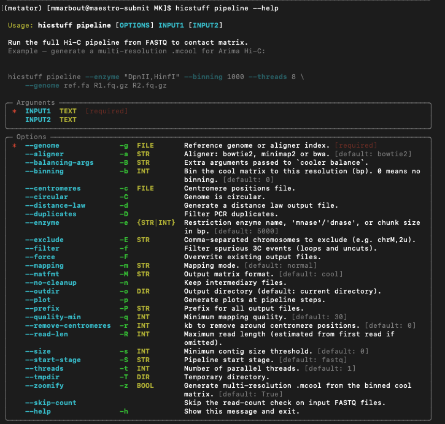

# Session 2

## génération du fichier matrice

le pipeline hicstuff permet de générer, à partir d'un génome (fasta) et de données de séuqnçage (HiC), un fihcier mcool (multicool) qui est le format standard des données HiC. 
[cooler package](https://github.com/open2c/cooler)

voici un schéma du pipeline:




il peut se réaliser par étape ou d'un seul coup.

```sh
hicstuff --help
```

nous allons lancer la commande pipeline pour lancer l'ensemble du pipeline en une seule fois.

```sh
hicstuff pipeline --help
```

les arguments à donner obligatoirement sont le génome (ou l'index), les fichiers fastq. Il y a également toute une série d'argument optionnel que l'on peut fournir au pipeline.



voici la commande à lancer (c'est un exemple pour le jeu de donnée Binome_1_1):

```sh
hicstuff pipeline --genome ref/PAO.fa \
				--binning 1000 \
				--distance_law \
				--duplicates \
				--enzyme DpnII,HinfI \
				--filter \
				--outdir HiC/binome_1_1/ \
				--plot \
				--prefix binome_X_1 \
				--threads 4 \
				--zoomify \
				--skip-count \
				fastq/Binome_1_1_R1.fq.gz \
				fastq/Binome_1_1_R2.fq.gz
```

cela risque de prendre un peu de temps ... 

donc pendant ce temps la nous allons installer les packages R nécessaire à l'analyse de nos données et faire quelques exercices sur des données tests.


## analyse d'une matrice d'interaction

PS: si vous le souhaitez, voici un lien vers un tutorial du package HiCExperiment :
[Tuto HiCExperiment](https://jserizay.com/OHCA/docs/devel/pages/data-representation.html)

commencer par copier les fichiers suivant sur gaia

```sh
mkdir -p cool_files/
scp votrelogin@sftpcampus.pasteur.fr:/pasteur/gaia/projets/p01/Enseignements/GAIA_ENSEIGNEMENTS/AdG_2026-2027/HiC/cool_files/exemple*.mcool cool_files/
```


lancer R studio et mettez vous dans le répertoire adéquat (TP_HiC) puis installez les packages suivant:

```sh
if (!require("BiocManager", quietly = TRUE))
    install.packages("BiocManager")
BiocManager::install(version = "3.18")
```

```sh
BiocManager::install("HiCExperiment", ask = FALSE)
BiocManager::install("HiCool", ask = FALSE)
BiocManager::install("HiContacts", ask = FALSE)
BiocManager::install("GenomicRanges", ask = FALSE)
```

on peut ensuite commencer à travailler sur nos fichiers cool.

```sh
library(HiCExperiment)
library(HiContacts)
library(GenomicRanges)
linrary(ggplot2)


coolf1 <-("cool_files/exemple1.mcool")
cf1 <- CoolFile(coolf1)
```

Plusieurs « emplacements » (c'est-à-dire des éléments d'information) sont associés à un objet `ContactFile` :

* Le chemin d'accès à la matrice de contacts stockée sur disque
* La résolution active (par défaut, la résolution la plus fine disponible dans une matrice de contacts multi-résolution)
* Optionnellement, le chemin d'accès à un fichier de paires correspondantes
* Certaines métadonnées.

```sh
cf
resolution(cf)
pairsFile(cf)
metadata(cf)
availableResolutions(cf1)
availableChromosomes(cf1)
```

NB: Les objets ContactFile ne sont que des connexions à un fichier HiC stocké sur disque. Bien que des métadonnées soient disponibles, ils ne contiennent pas les données elles-mêmes !


on peut ensuite créer un object HiCExperiment a partir de cette connexion:

```sh
hic1 <- import(cf1, resolution=5000)
```

```sh
interactions(hic1)
```

il est ensuite possible de mettre ces données sous forme de data frame.

```sh
data <- as.data.frame(hic1)
```

on peut également importer les données uniquement pour une région donnée:

```sh
hic1_zoom <- import(cf1, resolution=1000, focus="NZ_CP009712.1")
interactions(hic1_zoom)
```

il existe ensuite une fonction pour visualiser directement la matrice:

```sh
plotMatrix(hic1)
```

```sh
plotMatrix(hic1_zoom)
```

et oui c'est aussi simple que cela !!! 
mais il existe pleins d'arguments à la fonction plotMatrix qui permettent de modifier l'image (voir l'aide).


on peut réaliser différentes opérations sur ces données:

* visualiser la couverture du génome

```sh
gi  <- interactions(hic1)
id1 <- anchors(gi, type = "first",  id = TRUE)
id2 <- anchors(gi, type = "second", id = TRUE)
is_diag <- (id1 == id2) 
bins_diag <- anchors(gi[is_diag], type = "first")
bins_diag$count <- scores(hic, "count")[is_diag]
all_bins <- regions(hic1)
all_bins$count <- 0L
hits <- findOverlaps(bins_diag, all_bins, type = "equal")
all_bins$count[subjectHits(hits)] <- bins_diag$count[queryHits(hits)]

df <- data.frame(
  pos   = (start(all_bins) + end(all_bins)) / 2,
  count = all_bins$count,
  chr   = as.character(seqnames(all_bins))
)

ggplot(df, aes(x = pos / 1e6, y = count)) +
  geom_area(fill = "steelblue", alpha = 0.4) +
  geom_line(colour = "steelblue", linewidth = 0.3) +
  facet_wrap(~ chr, scales = "free_x", ncol = 1) +
  labs(
    x     = "Position (Mb)",
    y     = "Interactions intra-bin (count)",
    title = "Couverture Hi-C — diagonale (self-interactions)"
  ) +
  theme_minimal()
```

* visualiser la loi de distance génomique

```sh
ps_from_hic <- distanceLaw(hic1, by_chr = TRUE)
plotPs(ps_from_hic, aes(x = binned_distance, y = norm_p))
plotPsSlope(ps_from_hic, aes(x = binned_distance, y = slope))
```

* visualiser les interactions d'une zome du génome (4C plot)

```sh
v4C <- virtual4C(hic1, viewpoint = GRanges("NZ_CP009712.1:1-10000"))
v4C
```

```sh
df <- as_tibble(v4C)
ggplot(df, aes(x = center, y = score)) + 
    geom_area(position = "identity", alpha = 0.5) + 
    theme_bw() + 
    labs(x = "Position", y = "Contacts with viewpoint") +
    scale_x_continuous(labels = scales::unit_format(unit = "M", scale = 1e-06)) + 
    facet_wrap(~seqnames, scales = 'free_y')
```

* comparer deux matrices (a condition bien sur qu'elles aient été faites a partir du même génome)

```sh
coolf2 <-("cool_files/exemple2.mcool")
cf2 <- CoolFile(coolf2)
hic2 <- import(cf2, resolution=5000)
```

```sh
div_contacts <- divide(hic2, by = hic1)
plotMatrix(div_contacts,
		use.scores = 'balanced.fc', 
        scale = 'log2', 
        limits = c(-1, 1),
        cmap = bwrColors()
    )
```


* refaites la même chose avec l'exemple 3 et 4 (cool_files/exemple3.mcool & cool_files/exemple4.mcool)


## analyse de vos matrice d'interaction

maintenant que c'est fait , vous pouvez regarder où en est votre pipeline hicstuff et explorer les fichiers de sorties.


```sh
ls HiC/binome_1_1/
```

je vous laisse explorer tout ca et répondre aux questions suivantes:

* Q: Combien de reads aviez vous dans votre librairies ?
* Q: Quel est le taux de mapping de vos données sur le génome de référence ?
* Q: Quel est le taux de duplicats de PCR ?
* Q: Quels est le taux de reads conservées après le filtre de vos données ?
* Q: combien votre matrice contient de contacts ?


et maintenant faites moi une petite comparaison de vos matrices (vous pouvez également comparer entre vous !!!!!)


