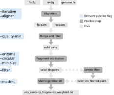
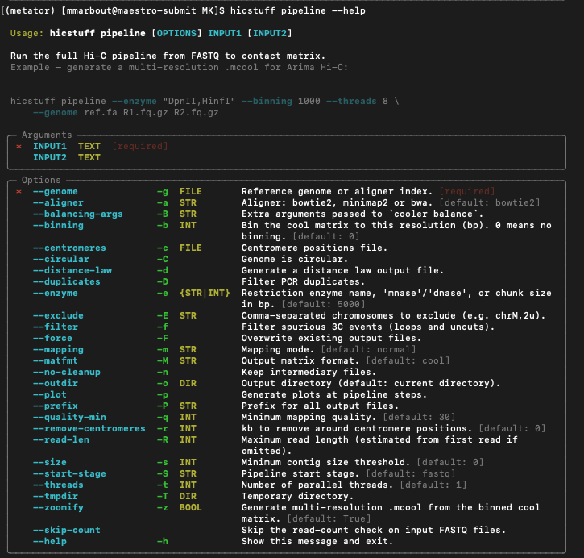
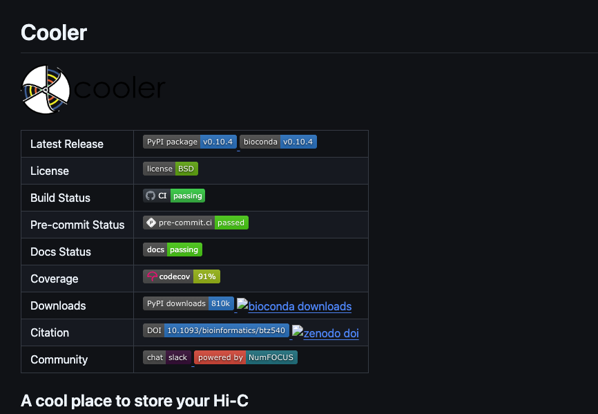
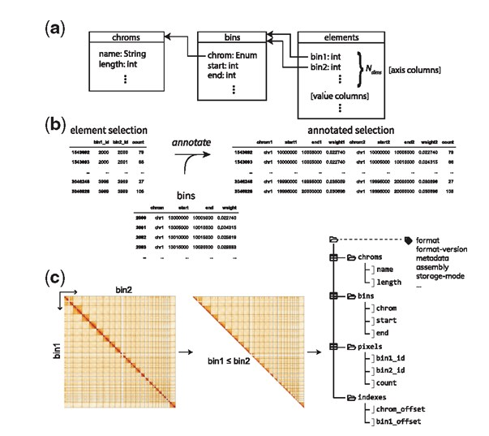

# Session 2

## récupérations des données

Pour le moment, nous allons travailler avec un jeu de données du labo.
Créer un répertoire pour y déposer les fichiers fastq et un répertoire pour le génome de référence.

```sh
mkdir -p fastq/
mkdir -p ref/
```

Récupérer les données correspondants en copiant les fichiers fastq.

```sh
scp votrelogin@sftpcampus.pasteur.fr:/pasteur/gaia/projets/p01/Enseignements/GAIA_ENSEIGNEMENTS/AdG_2026-2027/HiC/session2/exemple* fastq/
```

il faut également récupérer le fichier FastA correspondant à notre génome de référence.

```sh
mkdir -p ref/
scp votrelogin@sftpcampus.pasteur.fr:/pasteur/gaia/projets/p01/Enseignements/GAIA_ENSEIGNEMENTS/AdG_2026-2027/HiC/session2/Ecoli.fa ref/
```

si tout est bon, on peut vraiment commencer !! 

## génération d'un fichier matrice

le pipeline hicstuff permet de générer, à partir d'un génome (fasta) et de données de séuqnçage (HiC), un fihcier mcool (multicool) qui est le format standard des données HiC. 

voici un schéma du pipeline:



on n'oublie pas de se mettre dans le bon répertoire et d'activer l'environnement

```sh
cd ~/Bureau/TP_HiC/
micromamba activate hicstuff
```

Ce pipeline peut se réaliser étape par étape ou d'un seul coup (le mode pipeline).

```sh
hicstuff --help
```

nous allons lancer la commande pipeline pour lancer l'ensemble des opérations pour construire un fichier matrice en une seule fois.

```sh
hicstuff pipeline --help
```

les arguments à donner obligatoirement sont le génome (ou l'index), les fichiers fastq. Il y a également toute une série d'argument optionnel que l'on peut fournir au pipeline (nous y reviendrons).



voici la commande à lancer (c'est un exemple à partir du jeu de données de Escherichia coli):

```sh
hicstuff pipeline --genome ref/Ecoli.fa --binning 1000 --distance-law --duplicates --enzyme DpnII,HinfI --outdir hic/exemple/ --plot --prefix exemple --threads 4 --skip-count fastq/exemple_R1.fq.gz fastq/exemple_R2.fq.gz
```

cela ne devrait pas prendre plus de 10 minutes ...  

maintenant que c'est fait , vous pouvez regarder où en est votre pipeline hicstuff et explorer les fichiers de sorties.


```sh
ls hic/exemple/
```

je vous laisse explorer le fichier log de hicstuff et répondre aux questions suivantes:

* Q: Combien de reads initial avions nous dans ce jeu de données ?
* Q: Quel est le taux de mapping de ces données sur le génome de référence ?
* Q: Quel est le taux de duplicats de PCR ?
* Q: combien votre matrice contient de contacts ?

on peut également explorer le fichier de sortie (exemple.mcool) avec le package cooler qui est le programme de gestion des fichiers cool ou mcool.
Cooler est un programme de prise en charge d'un format de stockage utilisé pour stocker des données d'interaction génomique, telles que les matrices de contact Hi-C.

Le format de fichier Cooler est une implémentation d'un modèle de données matricielles génomiques utilisant HDF5 comme format de conteneur. Le paquet Cooler comprend une suite d'outils en ligne de commande ainsi qu'une API Python pour faciliter la création, l'interrogation et la manipulation des fichiers Cooler.



[cooler package](https://github.com/open2c/cooler)


```sh
ls cooler -h
```

la commande dump permet notamment d'avoir accès aux tables du fichier HDF5



```sh
ls cooler dump -t chroms hic/exemple/exemple.mcool::/resolutions/1000
```


