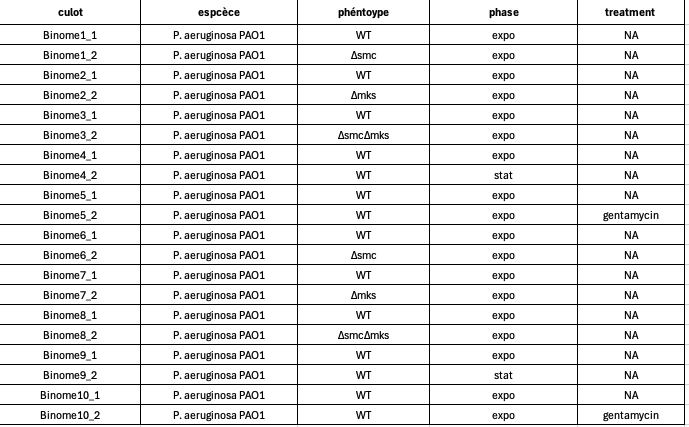

# Session 4

## Travail perso n°1

voici le tableau de vos banques avec les phénotypes, souches, conditions ... 

vos banques sont la:

sftpcampus.pasteur.fr:/pasteur/gaia/projets/p01/Enseignements/GAIA_ENSEIGNEMENTS/AdG_2026-2027/HiC/fastq/

et elles sont nommées selon le schéma suivant (X = numéro de votre binome): 
* Binome_X_1_R1.fq.gz
* Binome_X_1_R2.fq.gz
* Binome_X_2_R1.fq.gz
* Binome_X_2_R2.fq.gz

vous avez déjà récupéré le génome de référence (ref/PAO.fa).

faites moi une petite analyse / interprétations de vos résultats !! 

