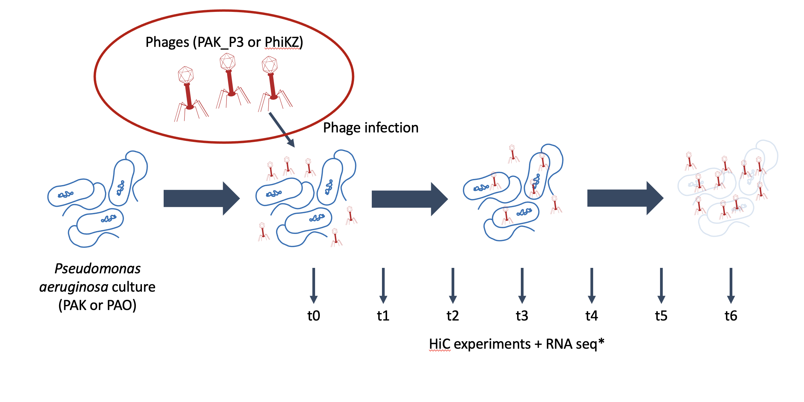
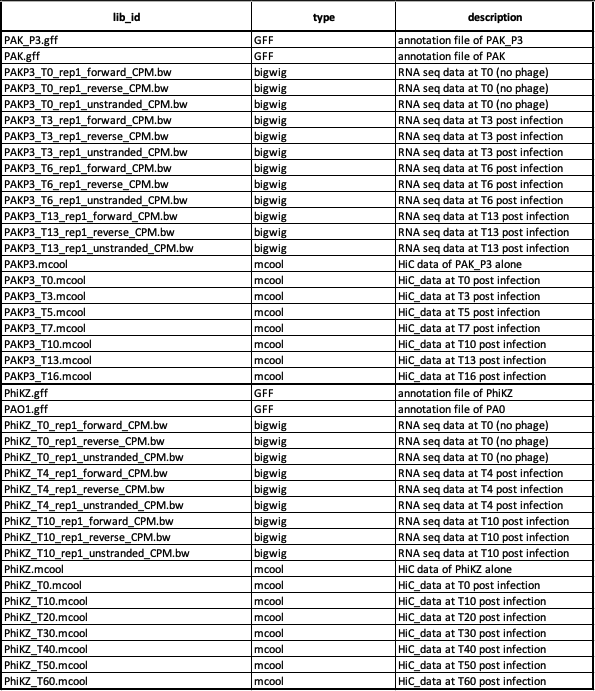

# Session 8

## Session de travail en groupe

on attaque la dernière ligne droite !! 

vous avez appris comment étudier / analyser des données HiC. comment les combiner avec des données de RNA seq . Il va maintenant falloir mettre tout cela en pratique avec une mise en situation !!

vous allez travailler en groupe sur un jeu de données provenant d'expérience ou nous avons étudier les cycles infectieux de deux phages au cours de l'infection de leur hote. Le protocole expérimental vous est présenté ci-dessous:

toutes les données sont la :

voici le tableau des métadonnées :

L'objectif est de faire une présentation de 15 minutes sur cette expérience en faisant en sorte de raconter une histoire ... il y a de quoi faire ... a vous de jouer !!!
